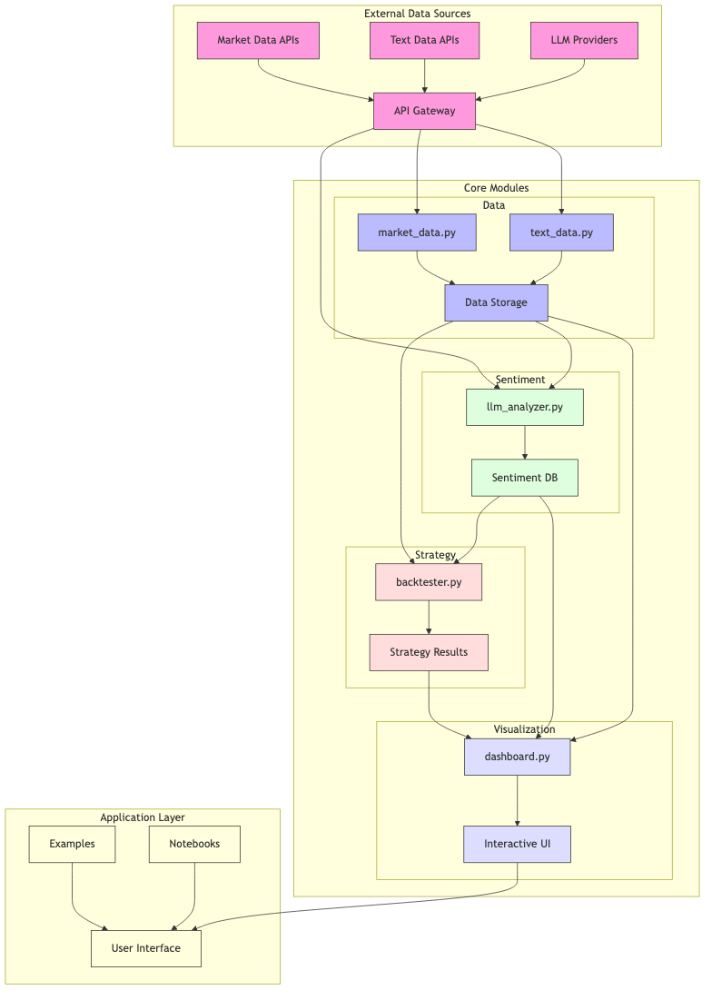
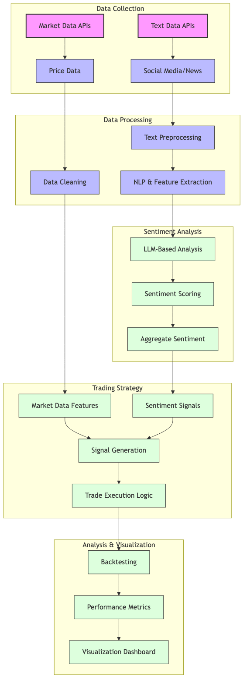
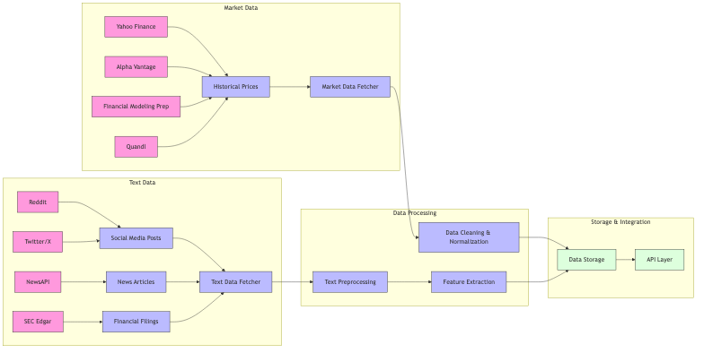
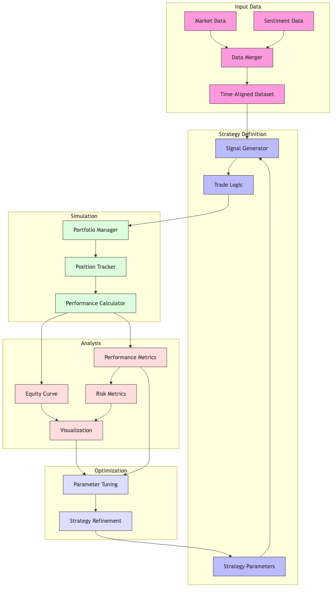
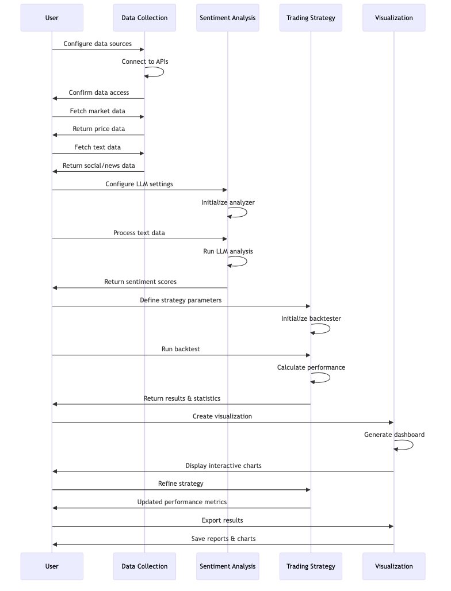

# FinSentinel Workflow Guide

This guide explains the core workflows and processes in FinSentinel, our financial market sentiment analysis and trading strategy toolkit.

## System Architecture

The FinSentinel system architecture is composed of multiple modules working together:



The architecture consists of:
- **External Data Sources**: APIs for market data, text data, and LLM providers
- **Core Modules**: Data, Sentiment, Strategy, and Visualization components
- **Application Layer**: Examples, notebooks, and user interfaces

## Overall Workflow

The overall workflow in FinSentinel follows these main steps:



1. **Data Collection**: Gathering market data and text data from various sources
2. **Data Processing**: Cleaning and preprocessing the collected data
3. **Sentiment Analysis**: Using LLMs to analyze sentiment in financial texts
4. **Trading Strategy**: Generating trading signals based on sentiment and market data
5. **Analysis & Visualization**: Backtesting strategies and visualizing the results

## Data Pipeline

The data pipeline is responsible for collecting, processing, and storing data:



Key components:
- **Market Data Sources**: Yahoo Finance, Alpha Vantage, FMP, Quandl
- **Text Data Sources**: Reddit, Twitter/X, NewsAPI, SEC Edgar
- **Processing**: Cleaning, normalization, and feature extraction
- **Storage**: Structured data storage for analysis

## Sentiment Analysis Process

The sentiment analysis process leverages LLMs to analyze financial texts:


The process includes:
1. **Input**: Preparing and cleaning text data
2. **LLM Processing**: Using prompt templates and LLM providers (OpenAI, Anthropic, Ollama)
3. **Response Processing**: Parsing LLM responses into structured data
4. **Aggregation**: Combining sentiment scores and extracting insights
5. **Signal Generation**: Translating sentiment into actionable trading signals

## Backtesting Workflow

The backtesting workflow enables testing and optimizing trading strategies:



This workflow consists of:
1. **Input Data**: Merging market and sentiment data
2. **Strategy Definition**: Setting parameters and defining signal generation
3. **Simulation**: Managing a portfolio and tracking positions
4. **Analysis**: Calculating performance metrics and visualizing results
5. **Optimization**: Refining strategies based on performance

## User Workflow

A typical user workflow for interacting with FinSentinel:



This sequence diagram shows:
1. How users configure data sources and fetch data
2. The process of analyzing sentiment with LLMs
3. Steps for defining and running backtests
4. Creating visualizations and refining strategies

## Working with Diagrams

### Viewing Diagrams

The diagrams are available as:
- PNG images in the `finsentinel/docs/images/` directory
- Mermaid source files (.mmd) that can be modified

### Generating Diagrams

To generate PNG images from Mermaid source files:

1. Install the Mermaid CLI:
   ```bash
   npm install -g @mermaid-js/mermaid-cli
   ```

2. Run the conversion script:
   ```bash
   python finsentinel/docs/images/convert_diagrams.py
   ```

### Customizing Diagrams

To modify the diagrams:
1. Edit the `.mmd` files in `finsentinel/docs/images/`
2. Run the conversion script to generate updated PNGs
3. The diagrams will automatically be included in the documentation

## Including in Your Own Projects

To include these diagrams in your own documentation:

```markdown

```

You can also embed them in Jupyter notebooks using:

```python
from IPython.display import Image
Image(filename='../docs/images/overall_workflow.png')
``` 